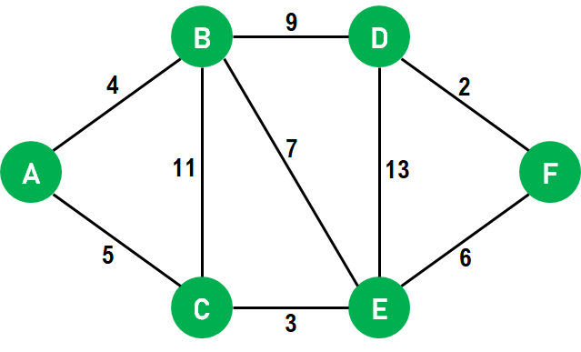
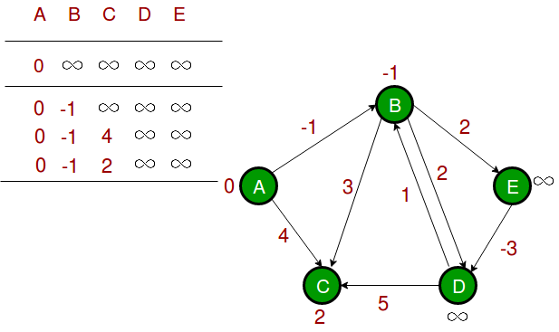
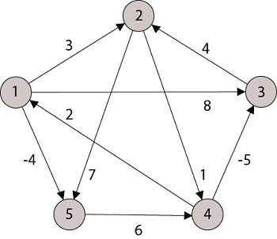

## Dijkstra's Algorithm:

### Overview:
Dijkstra's Algorithm is a single-source shortest path algorithm. It finds the shortest path from a specified starting node to all other nodes in a weighted, directed or undirected graph.

### Key Concepts:
1. **Greedy Approach:** Dijkstra's Algorithm uses a greedy approach by selecting the node with the smallest distance (or cost) at each step.

2. **Priority Queue:** It maintains a priority queue to efficiently select the node with the smallest distance.

3. **Visited Nodes:** It keeps track of visited nodes to avoid revisiting them.

4. **Relaxation:** Dijkstra's Algorithm iteratively relaxes the edges, updating the distance to each neighboring node if a shorter path is found.

### Use Cases:
- Finding the shortest path in computer networks, such as routing packets.
- Solving the "traveling salesman problem" in certain scenarios.

### Time Complexity:
- With a binary heap: O((V + E) log V)
- With a Fibonacci heap: O(V log V + E)

## Diagram

---

## Bellman-Ford Algorithm:

### Overview:
Bellman-Ford is a single-source shortest path algorithm that can handle negative weight edges. It detects negative weight cycles and returns an error if one is found.

### Key Concepts:
1. **Dynamic Programming:** It uses a dynamic programming approach to find the shortest paths.

2. **Iterative Relaxation:** Bellman-Ford performs V-1 iterations (where V is the number of vertices) and relaxes all edges in each iteration.

3. **Checking for Negative Cycles:** After V-1 iterations, it performs one more iteration to check for negative cycles. If a shorter path is found, it means there's a negative cycle.

### Use Cases:
- Handling scenarios where negative weights are possible, such as financial transactions (with debt).
- Network routing where negative costs could represent benefits (like toll discounts).

### Time Complexity:
- O(V * E) - where V is the number of vertices and E is the number of edges.

## Diagram

---

## Floyd-Warshall Algorithm:

### Overview:
Floyd-Warshall is an all-pairs shortest path algorithm. It finds the shortest paths between all pairs of nodes in a weighted directed or undirected graph.

### Key Concepts:
1. **Dynamic Programming:** Like Bellman-Ford, it uses dynamic programming to find shortest paths.

2. **Iterative Approach:** Floyd-Warshall iterates through all pairs of nodes, considering each node as a possible intermediate node.

3. **Matrix Representation:** It uses a matrix to store distances between nodes and updates the matrix in each iteration.

### Use Cases:
- Calculating distances in transportation networks.
- Analyzing social networks for metrics like network diameter.

### Time Complexity:
- O(V^3) - where V is the number of vertices.

## Diagram

---

## Comparison:

### Applicability:
- Dijkstra's is for single-source shortest path.
- Bellman-Ford is for single-source shortest path with negative weights.
- Floyd-Warshall is for all-pairs shortest path.

### Negative Weights:
- Dijkstra's and Floyd-Warshall do not handle negative weights (Dijkstra's can be modified with certain conditions).
- Bellman-Ford can handle negative weights but is less efficient than Dijkstra's for positive weights.

### Complexity:
- Dijkstra's and Bellman-Ford have similar time complexity.
- Floyd-Warshall has a higher time complexity but works for all pairs.

### Suitable Situations:
- Dijkstra's is suitable for most scenarios.
- Bellman-Ford is suitable when there are negative weights (and no negative cycles).
- Floyd-Warshall is suitable when you need to find all pairs of shortest paths.

In summary, the choice of algorithm depends on the specific problem, the nature of the graph, and whether negative weights or all pairs of shortest paths are involved. Each algorithm has its strengths and use cases.